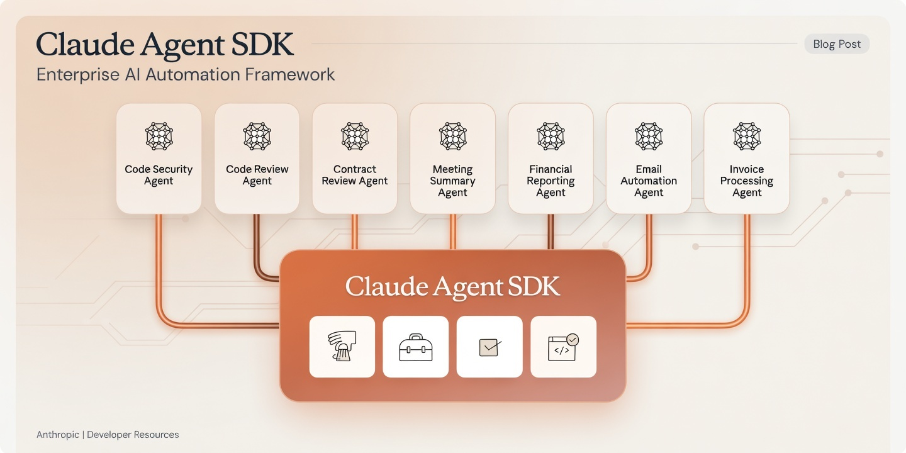
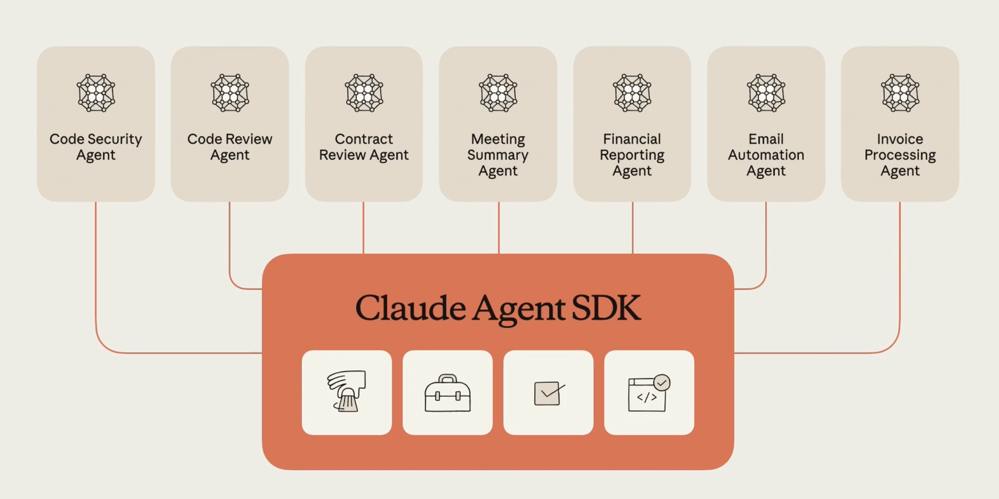

# Building Specialised AI Agents with the Claude Agent SDK

**The Claude Agent SDK lets you build purpose-built AI Agents in Python. Each agent gets its own system prompt, its own tool set and its own scope. The SDK handles the agentic loop. You define what each agent does.**

## Agent SDK vs Agent Teams

Two different layers solving two different problems.


### Claude Agent SDK

A Python/TypeScript package for building **your own agents** programmatically. You write code. You define system prompts, tools, permissions. You control the agentic loop from your application.

The SDK is a developer tool. It produces agents that run in your infrastructure, your pipelines, your products. The seven agents in the blog post, each one is a Python script you wrote and deployed yourself.

**You are the builder.** The SDK is your construction material.

### Claude Agent Teams

A feature inside **Claude Code** (the CLI tool) where Claude itself spawns and coordinates multiple sub-agents during a single task. You give Claude a complex prompt. Claude decides it needs help. Claude creates specialist agents on the fly to handle parts of the work.

For example you say "refactor this authentication module." Claude might spawn a research agent to understand the current code, a planning agent to design the new architecture and an implementation agent to write the changes. You did not define those agents. Claude did.

**Claude is the builder.** The agents are its internal workforce.



### The Distinction

| | Agent SDK | Agent Teams |
|---|----------|-------------|
| **Who defines the agents** | You (the developer) | Claude (the model) |
| **Where they run** | Your code, your infra | Inside Claude Code sessions |
| **Configuration** | Explicit (system prompts, tools, permissions) | Implicit (Claude decides scope and delegation) |
| **Use case** | Production agent systems, repeatable workflows | Ad-hoc complex tasks during a Claude Code session |
| **Control** | Full — you set every parameter | Minimal — Claude orchestrates autonomously |
| **Persistence** | Your agents exist as code you maintain | Agents are ephemeral, created per task |

The SDK is for when you know what agents you need and want to ship them. Agent Teams is for when the task is complex enough that Claude benefits from dividing the work internally.

One is infrastructure. The other is behaviour.

---

## The Core Idea

Most agent frameworks give you a generic agent and expect you to make it do everything. The Claude Agent SDK takes the opposite approach. You build multiple specialised agents, each with a narrow mandate, restricted tools and a focused system prompt.

A code security agent only reads files. A contract review agent only processes documents. An invoice agent only extracts structured data. None of them can do what the others do. That constraint is the point.

The SDK provides the runtime. You provide the specialisation.

## How It Works

The SDK has two entry points.

**`query()`** is a one-shot async function. You send a prompt, configure the agent and stream back messages. Good for single-task agents.

**`ClaudeSDKClient`** is a session-based client. It maintains context across multiple turns. Good for conversational agents or multi-step workflows.

Both support the same configuration surface.

```python
from claude_agent_sdk import query, ClaudeAgentOptions

async for message in query(
    prompt="Review auth.py for security vulnerabilities",
    options=ClaudeAgentOptions(
        system_prompt="You are a security auditor. Report vulnerabilities only.",
        allowed_tools=["Read", "Grep", "Glob"],
        permission_mode="acceptEdits",
        max_turns=10,
    ),
):
    print(message)
```

Three things define an agent.

**System prompt**  what the agent is. A code reviewer. A contract analyst. An invoice processor. The system prompt sets the agent's identity and constraints.

**Allowed tools**  what the agent can do. Read files. Run shell commands. Search the web. Fetch URLs. Each agent gets only the tools it needs. A read-only agent cannot write. A search agent cannot edit files.

**Permission mode**  how much autonomy the agent has. Default mode asks the user before destructive actions. Accept-edits mode auto-approves file changes. Bypass mode runs fully autonomous.

## The Tool Surface

The SDK ships with built-in tools that map to real capabilities.

| Tool | What It Does |
|------|-------------|
| **Read** | Read file contents |
| **Write** | Create new files |
| **Edit** | Modify existing files (precise string replacement) |
| **Bash** | Run terminal commands |
| **Glob** | Find files by pattern |
| **Grep** | Search file contents with regex |
| **WebSearch** | Search the web |
| **WebFetch** | Fetch and parse web pages |

You can also define custom tools using the `@tool` decorator and MCP (Model Context Protocol) servers. This lets you expose any Python function as a tool the agent can call.

```python
from claude_agent_sdk import tool, create_sdk_mcp_server

@tool("extract_invoice", "Extract structured data from invoice text", {
    "text": str
})
async def extract_invoice(args):
    # Your extraction logic here
    return {"content": [{"type": "text", "text": result}]}

server = create_sdk_mcp_server(
    name="invoice-tools",
    version="1.0.0",
    tools=[extract_invoice],
)
```

## Subagents  Specialisation Through Delegation

The real power is subagents. A parent agent can spawn specialised child agents for focused subtasks. Each subagent runs in its own context. The parent only sees the summary, not the intermediate tool calls.

```python
from claude_agent_sdk import query, ClaudeAgentOptions, AgentDefinition

options = ClaudeAgentOptions(
    allowed_tools=["Read", "Glob", "Agent"],
    agents={
        "security-reviewer": AgentDefinition(
            description="Reviews code for security vulnerabilities",
            prompt="You are a security expert. Identify OWASP top 10 issues.",
            tools=["Read", "Grep", "Glob"],
        ),
        "performance-reviewer": AgentDefinition(
            description="Reviews code for performance bottlenecks",
            prompt="You are a performance engineer. Find N+1 queries, memory leaks, blocking calls.",
            tools=["Read", "Grep", "Glob"],
        ),
    },
)
```

The parent agent decides which subagent to invoke based on the task. The security reviewer never sees performance code. The performance reviewer never flags security issues. Each agent stays in its lane.

This is the pattern from the diagram. One SDK. Many specialised agents. Each with a distinct purpose.

## Message Stream

The SDK returns a stream of typed messages. You handle them based on type.

```python
from claude_agent_sdk import AssistantMessage, ResultMessage, TextBlock, ToolUseBlock

async for message in query(prompt="...", options=options):
    if isinstance(message, AssistantMessage):
        for block in message.content:
            if isinstance(block, TextBlock):
                print(block.text)
            elif isinstance(block, ToolUseBlock):
                print(f"Tool: {block.name}")

    elif isinstance(message, ResultMessage):
        print(f"Done. Cost: ${message.total_cost_usd}")
```

The stream gives you full visibility into the agent's reasoning, tool calls and final output. No black box.

## Seven Agents, One SDK

The image at the top of this post shows seven agents built on the same SDK.

| Agent | System Prompt Focus | Tools |
|-------|-------------------|-------|
| Code Security Agent | OWASP vulnerabilities, injection, auth flaws | Read, Grep, Glob |
| Code Review Agent | Code quality, patterns, readability | Read, Grep, Glob, Bash |
| Contract Review Agent | Legal terms, risk clauses, obligations | Read, WebFetch |
| Meeting Summary Agent | Action items, decisions, owners | Read, Write |
| Financial Reporting Agent | Revenue, margins, anomalies | Read, Bash, Write |
| Email Automation Agent | Drafting, routing, priority classification | Read, Write, WebFetch |
| Invoice Processing Agent | Line items, totals, vendor matching | Read, Write, custom tools |

Each agent is a configuration, not a codebase. The SDK is the same. The system prompt, tools and constraints make each one distinct.

## What This Gets Right

**Constraint is a feature.** An agent that can do everything will eventually do the wrong thing. Restricting tools per agent is not a limitation. It is a safety boundary.

**Context isolation prevents contamination.** Subagents run in their own context. A security audit does not pollute a performance review. Each agent reasons independently.

**The agentic loop is handled.** You do not write the tool-call-parse-retry loop. The SDK manages it. You define the agent's purpose and tools. The SDK handles execution.

**Custom tools are first-class.** The `@tool` decorator and MCP integration mean you can expose any API, database or service as a tool. The agent calls it like any built-in tool.

## The Principle

The Claude Agent SDK is a runtime for specialised AI Agents. Not a chatbot framework. Not a prompt wrapper. A runtime that gives each agent a defined identity, scoped capabilities and isolated context.

The specialisation is the product. The SDK is the infrastructure.

---

*Chief Evangelist @ Kore.ai | I'm passionate about exploring the intersection of AI and language. Language Models, AI Agents, Agentic Apps, Dev Frameworks & Data-Driven Tools shaping tomorrow.*
